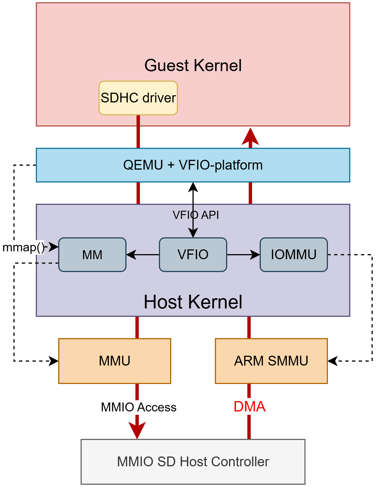

#  Giving a KVM/QEMU Virtual Machine direct access to a memory-mapped hardware device with VFIO (ARM)

The goal is to give a QEMU/KVM VM direct access to a physical memory-mapped SD Host Controller through VFIO on an ARM embedded SoC, in that case, a Zynq UltraScale+ MPSoC (ZCU104).

**Secure** direct hardware access (I/O passthough) of a SoC-integrated memory-mapped device in KVM/VFIO can be challenging for the following reasons:

- No standard reset mechanisms
- Devices may share hardware resources
- Various interrupt delivery mechanisms
- No standard discovery mechanisms as for PCI
- Lack of hardware support (e.g., SMMU, ITS)

This guide walks through the obstacles I faced and the steps needed to achieve this goal. It covers **HOst and VM tracing & debugging**, **Device Tree configuration**, and **Linux driver internals**

**VFIO**  is a framework in the Linux kernel that allows safe, direct user-space access to PCI and memory-mapped hardware devices by exposing them through the VFIO API. VFIO rely on the IOMMU to isolate the device’s DMA to the guest’s memory space and passes its MMIO regions and interrupts directly to user space application, enabling near-native performance while maintaining security.

QEMU, a user-space application, relies VFIO to pass a hardware device directly to a VM. VFIO exposes the device’s registers, interrupts, and DMA capabilities as file descriptors, while enforcing IOMMU-based isolation so the device can only access the VM’s memory. QEMU maps these file descriptors into the guest’s address space and forwards MMIO and interrupt events, allowing the guest OS to run its own native driver as would in a native environement.




### Setting up the Host

First, the host Linux kernel must be compiled with VFIO support (i.e., `CONFIG_VFIO`, `CONFIG_VFIO_PLATFORM`, `CONFIG_VFIO_CONTAINER`, `CONFIG_VFIO_GROUP`, `CONFIG_VFIO_IOMMU_TYPE1`). It must also be ensured that the SD Host Controller is not bound to the physical device driver (sdhci-of-arasan) in the host at boot time—either by making the driver a loadable kernel module or by modifying the host's device tree.

In addition, the ARM SMMU driver (IOMMU) must be enabled (`CONFIG_IOMMU_SUPPORT`, `CONFIG_ARM_SMMU`, `CONFIG_ARM_SMMU_V3`, `CONFIG_ARM_SMMU_DISABLE_BYPASS_BY_DEFAULT`) so that the DMA-capable device can be safely assigned to a guest VM or userspace application. Without IOMMU support, a userspace program or a VM could instruct the device to perform DMA reads or writes into arbitrary host memory, which would break isolation. For this reason, VFIO would refuse giving a userspace program (or a QEMU VM) direct access to a physical device unless the VFIO driver is built with no-IOMMU support (`CONFIG_VFIO_NOIOMMU`). This can be required on certain embedded platforms which does not have IOMMU support, but this lets the host kernel vulnerable to DMA attacks. In the case of the ZCU104, since it has an IOMMU, VFIO does not require to be built with no-IOMMU support

In the host device tree, it must be ensured that any DMA accesses from the device to be passed through to userspace or a VM are routed through the IOMMU. Enventually, the driver for the SDHC can be changed from the physical driver name (i.e? arasan,sdhci-8.9a) to vfio-platform.

```c
smmu: iommu@fd800000 {
			compatible = "arm,mmu-500";
			reg = <0x0 0xfd800000 0x0 0x20000>;
			#iommu-cells = <1>;
			status = "okay";
    		...
};

sdhci1: mmc@ff170000 {
			/* compatible = "xlnx,zynqmp-8.9a", "arasan,sdhci-8.9a"; */
			compatible = "vfio-platform";
			status = "disabled";
			reg = <0x0 0xff170000 0x0 0x1000>;
            iommus = <&smmu 0x871>; /* Assigning Stream ID 0x871 to the SDHC */
    		...
}
```

​	*NB: The Stream ID assigned to the device is different from the Group ID assigned by VFIO*

### How to use VFIO:

Now that the host Linux kernel is compiled and the device tree is properly configured to ensure the SDHC DMA passes through the IOMMU, the device can be bound to `vfio-platform`:

```bash
was# Find the device name — e.g., from /sys/devices/platform/
DEVICE=ff170000.mmc

# Enventually unbind from current driver
echo $DEVICE > /sys/bus/platform/drivers/sdhci-of-arasan/unbind

# Bind to vfio-platform
echo vfio-platform > /sys/bus/platform/devices/$DEVICE/driver_override
echo $DEVICE > /sys/bus/platform/drivers_probe
```

Once bound to VFIO, the device should appear in an IOMMU group, ready to be securely passed through to a userspace application or a QEMU guest, but:

​	`Invalid argument, and probe failed with error -22` 

### DMA coherent access

The MMC node in the host device tree is not bound to the physical device driver (e.g., `sdhci-of-arasan`) but instead to VFIO, which is responsible for passing the device through to the guest. The guest then implements and runs the physical device driver (e.g., `sdhci-of-arasan`). As such, the property `dma-coherent` must be added to the MMC node in the host's device tree.

This property indicates that the device’s DMA engine is hardware cache-coherent with the CPU, meaning that when the device performs DMA reads/writes, the CPU cache lines and the device’s view of memory remain synchronised. If the property is **missing**, the kernel assumes the device is **non-coherent**, so the driver must either allocate non-cacheable buffers for DMA or explicitly clean/invalidate caches (e.g., as in`sdhci.ko` using `dma_sync_*()`).

If the device were non-coherent, VFIO would have no way to manage cache flushing for the guest, meaning guest data could remain stale in CPU caches and never reach DRAM, or DMA writes from the device might not be visible to the guest. In addition, since DMA is instructed by the driver in the guest, VFIO in the host has no means to know when caches should be invalidated.  Declaring the device `dma-coherent` ensures the guest and the device always see the same up-to-date memory contents without extra cache maintenance.

Now, we can try to probe the VFIO driver again:

`No reset function found for device ff170000.mmc`


### Lack of Standard Rest Mechanisms

VFIO includes mechanisms to **reset a device**, ensuring it is in a clean and known state before assigning it to a VM for security and stability reasons. Indeed, a device control register could leak data from a previous execution in the host. Imagine passing a NIC to a VM without reset, the RX ring buffers could still contain host network traffic. Also, the guest driver expects “power-on” conditions; starting from an unknown state can cause the guest driver to misconfigure the device or crash.

PCI has **FLR** (Function Level Reset) or hot reset at the bus level, on which VFIO can rely to reinitialize the underlying device in a generic way. SoC-integrated MMIO devices usually have **no standard reset interface**. sometimes it’s a GPIO, sometimes it is a control register, sometimes the reset function is even shared with other peripherals, making generic VFIO support impractical.

There are two ways to deal with non-standard reset mechanisms that VFIO can not handle. First, a reset hook can be implemented in the kernel. Practically, you implement a kernel reset module that uses the Linux **reset-controller API** (or the vendor-specific mechanism) to stop DMA, disable interrupts, and put hardware in a known state. Then, VFIO looks up a reset implementation for the device (via the DT's compat or the generic DT reset support) and calls it when passing the device, or when `VFIO_DEVICE_RESET` is invoked:

```c
/* vfio/platform/vfio_platform_private.h */
typedef int (*vfio_platform_reset_fn_t)(struct vfio_platform_device *vdev);

struct vfio_platform_reset_node {
	struct list_head link;
	char *compat;
	struct module *owner;
	vfio_platform_reset_fn_t of_reset;
};

static int vfio_platform_get_reset(struct vfio_platform_device *vdev)
{
...
	vdev->of_reset = vfio_platform_lookup_reset(vdev->compat,
						    &vdev->reset_module);
...
	return vdev->of_reset ? 0 : -ENOENT;
}
```

Alternatively, reset can be explicitly marked as **not required** in VFIO through a kernel module parameter, allowing the device to be passed through to userspace without being reset beforehand. In our case, the SDHC is not used by the host before assigning it to the guest VM, so we can safely pass the device through to the VM without a prior reset. 

<u>Setting resets as not required in VFIO:</u>

- With a property in the MMC node of the host's device tree.
  - `vfio,no-reset;`
- At boot time, as a kernel boot parameter.
  - `vfio-platform.reset_required=0`
- When loading vfio-platform.
  - `modprobe vfio-platform reset_required=0`
- At runtime.
  - `echo 0 > /sys/bus/platform/devices/$DEVICE/vfio_platform/reset_required`

Now, we can try to probe the VFIO driver again:

`vfio_iommu_type1_attach_group: No interrupt remapping support`

### Lack of interrupt remapping support

Interrupt remapping enables assigning arbitrary guest IRQ numbers independently of the host IRQ numbers. Interrupt remapping makes sure the guest sees **clean, dedicated interrupt lines** that it can fully control. VFIO needs to register the device’s IRQ in the host kernel so that an interrupt triggers an eventfd, which KVM can inject into the VM’s virtual GIC. PCI devices have a well-standardised way of delivering interrupts (MSI/MSI-X or legacy INTx), which enables VFIO to easily handle and inject them into the VM via KVM’s `irqfd`.

However, platform devices can use various types of interrupt delivery mechanisms, especially on ARM-based systems. On ARM, hardware memory-mapped devices can assert two main types of IRQs:

​	 **PPI (Private Peripheral Interrupt)** and **SPI (Shared Peripheral Interrupt)**.

PPIs are physically wired to a single CPU interface of the Generic Interrupt Controller (GiC). If a peripheral using a PPI was passed through to a guest VM, the guest vCPU should always run on that specific physical CPU core. For this reason, such devices cannot be reliably passed through to a VM, as the guest’s vCPU may be scheduled on a different core over time. This would also prevent dynamically adding or removing CPUs from the guest (CPU hotplug).

*NB: Peripherals relying on PPIs are usually not physical devices that are likely to be directly assigned to a guest VM (e.g., local timer, watchdog).*

On the other hand, **SPIs** are global interrupts that can be routed to any CPU and can thus be easily injected into a VM's vCPU. This flexibility means that when a VM runs, its virtual CPUs (vCPUs) can receive the interrupt on any physical CPU core, regardless of which CPU the guest's vCPU is scheduled on by the host at that moment. However, there can still be other limitations in embedded platforms that prevent the underlying peripheral from being safely or easily passed through to a guest VM:

- First, multiple devices may share the same interrupt. A shared IRQ is a single physical line for multiple devices, so an interrupt on that line doesn’t identify which device raised it. In passthrough, you must route that line either to the guest or the host. If the interrupt is routed to the host, the guest’s device won’t be serviced. If routed to the guest, the host’s other device won’t be serviced. This can also cause **spurious interrupts** in the guest, leading to incorrect interrupt handling, crashes, or data corruption. 
- Besides this, some interrupts are *chained* through intermediate interrupt controllers or aggregators before reaching the GIC. While the GIC itself can be partly virtualised, the guest VM does not have direct control over the intermediate hardware interrupt controllers managing the peripheral’s interrupts. As a result, passing through a device that relies on such interrupts is challenging or even impossible.

The Zynq UltraScale+ MPSoC implements the GICv2, which does not provide interrupt remapping support. However, the SDHC peripheral can be safely assigned to a VM without remapping support, since it does not rely on PPIs (or MSIs) and does not share its IRQ line with other devices. Thus, the VFIO IOMMU driver’s **requirement for interrupt remapping** can be disabled through a module parameter:

```
vfio_iommu_type1.allow_unsafe_interrupts=1
```

### Testing userspace direct access to memory-mapped platform device

Now, we can try to probe the VFIO driver again, and the device is finally assigned to a group:


The device can finally be passed through to a userspace application (e.g., a QEMU VM). To this end, the VFIO framework provides a number of functions to userspace through ioctls (e.g., `VFIO_DEVICE_GET_REGION_INFO`, `VFIO_IOMMU_MAP_DMA`, `VFIO_DEVICE_GET_IRQ_INFO`) that enable handling interrupts, managing DMA mappings, or eventually resetting the device. Below is a code snippet of a userspace program that reads from or writes to the control register of a peripheral device passed through via VFIO:

```c
    // Get MMIO information from device FD
	if (ioctl(device_fd, VFIO_DEVICE_GET_REGION_INFO, &reg)) {
        perror("GET_REGION_INFO"); return 1;
    }

    // mmap MMIO region
    mmio = mmap(NULL, reg.size, PROT_READ | PROT_WRITE, MAP_SHARED, device_fd, reg.offset);
    if (mmio == MAP_FAILED) {
        perror("mmap"); return 1;
    }

    // Access register
    volatile uint32_t *reg_ptr = (uint32_t *)((uint8_t *)mmio + REG_OFFSET);
    uint32_t val = *reg_ptr;
    printf("Read: 0x%08x\n", val);

    *reg_ptr = val + 1;
    printf("Wrote: 0x%08x\n", val + 1);
```


## QEMU & Device Trees 

Now that VFIO is configured, a KVM/QEMU guest VM can be run. As the SDHC device is passed through to the VM, the guest OS kernel has to implement the physical SDHC driver physicals:

```
CONFIG_MMC=y
CONFIG_MMC_BLOCK=y
CONFIG_MMC_SDHCI=y
CONFIG_MMC_SDHCI_PLTFM=y
CONFIG_MMC_SDHCI_OF_ARASAN=y
```


```bash
qemu-system-aarch64 \
  -machine virt,accel=kvm,gic-version=3 \
  -cpu host \
  -m 1024 \
  -nographic \
  -kernel Image \
  -initrd rootfs.cpio \
  -dtb zynqmp-virt.dtb \
  -append "console=ttyAMA0 root=/dev/ram rw earlycon" \
  -device vfio-platform,host=ff170000.mmc
```


When running an ARM guest VM with KVM/QEMU, the option `-dtb` can be used to pass a custom device tree to the guest. However, when providing a custom device tree, **all devices exposed to the guest must be described**, including virtual devices and memory regions created by QEMU. These resources can be inspected using the QEMU monitor command `info qtree`.

If `-dtb` is not specified, QEMU automatically generates a device tree containing the proper nodes for the virtual devices it exposes, ensuring that the guest can boot correctly. But when using **VFIO platform passthrough** (e.g., `-device vfio-platform`), QEMU cannot generate the node for the physical device being passed through, since it has no knowledge of how that node should be described. In this case, a custom device tree must be provided, including the corresponding node (such as the `sdhci` controller) so that the guest kernel can use the hardware device.

However, simply passing a minimal device tree with the passthrough device is not enough. QEMU assigns additional (virtual) devices and resources to the guest (timers, interrupt controllers, UART, RAM, etc.), which must also be described, otherwise your guest would probably not be able to boot: 

```bash
Kernel panic - not syncing: Unable to initialise architected timer
```


To pass a correct device tree, a guest VM can be run without `-dtb` and the **QEMU-generated device tree** can be dumped from the guest and then decompiled into a source DT:

```bash
# Reconstruct the guest's device tree generated by QEMU
dtc -I fs /proc/device-tree -O dtb -o /tmp/qemu-runtime.dtb
# Decompile the guest's device tree into a DTS
dtc -I dtb -O dts qemu-runtime.dtb -o qemu-runtime.dts
```

Once the QEMU-generated guest's device tree has been dumped, a node for the SDHC device can be appended and the guest VM can successfully boot with a custom device tree.

#### Adapting the MMC node in the guest device tree:

In a bare-metal environment, SDHC drivers depend on several hardware resources—such as clock controllers, reset controllers, pin controllers, and power management—to properly operate the device. However, these hardware resources are not accessible to the guest OS when the SDHC is passed through via VFIO. As a result, the guest device tree must be adapted so that the driver can function without them, which may sometimes require workarounds or hacks.

#### Clocks


```c
clk_ahb: clk_ahb {
    compatible = "fixed-clock";
    #clock-cells = <0>;
    clock-frequency = <0xb2d05e0>; /* Value set based on the host's DT */
};

clk_xin: clk_xin {
    compatible = "fixed-clock";
    #clock-cells = <0>;
    clock-frequency = <0xb2d05e0>; /* Value set based on the host's DT */
};

mmc0: mmc@ff170000 {
    compatible = "xlnx,zynqmp-8.9a", "arasan,sdhci-8.9a";
    reg = <0x0 0xff170000 0x0 0x1000>;
    interrupts = <0 49 4>;
    status = "okay";
	...
	clocks = <&clk_ahb>, <&clk_xin>;
	clock-names = "clk_ahb", "clk_xin";
};
```

### Voltage

Let's try to bind the SDHC device to the driver again:

```
mmc0: Hardware doesn't report any support voltages.
```

This typically means that the **Device Tree node** for the SDHCI (MMC) controller is missing either:

1. **Regulator information**, or
2. The **voltage capability flags** 

To that extent, nodes for fixed regulator must be appended to the guest DT:

    vmmc_reg: regulator-vmmc {
        compatible = "regulator-fixed";
        regulator-name = "vmmc";
        regulator-min-microvolt = <3300000>;
        regulator-max-microvolt = <3300000>;
        regulator-always-on;
    };
    
    vqmmc_reg: regulator-vqmmc {
        compatible = "regulator-fixed";
        regulator-name = "vqmmc";
        regulator-min-microvolt = <1800000>;
        regulator-max-microvolt = <1800000>;
        regulator-always-on;
    };
    
    mmc0: mmc@ff170000 {
        compatible = "xlnx,zynqmp-8.9a", "arasan,sdhci-8.9a";
        reg = <0x0 0xff170000 0x0 0x1000>;
        interrupts = <0 49 4>;
        status = "okay";
    	...
    	clocks = <&clk_ahb>, <&clk_xin>;
    	clock-names = "clk_ahb", "clk_xin";
    	vmmc-supply = <&vmmc_reg>;
    	vqmmc-supply = <&vqmmc_reg>;
    };

*NB: The guest also needs to be compiled with `CONFIG_REGULATOR_FIXED_VOLTAGE=y`, `CONFIG_REGULATOR=y`*


------

### No Access to MMIO Region

At this stage, a clock error appears. However, from the register dump of the SDHC driver, all values are `0x00000000`, which means the driver can clearly not access the SDHC’s control registers:

```
mmc0: Internal clock never stabilised. 
mmc0: sdhci: ============ SDHCI REGISTER DUMP ===========
mmc0: sdhci: Sys addr:  0x00000000 | Version:  0x00000000 
mmc0: sdhci: Blk size:  0x00000000 | Blk cnt:  0x00000000 
mmc0: sdhci: Argument:  0x00000000 | Trn mode: 0x00000000 
mmc0: sdhci: Present:   0x00000000 | Host ctl: 0x00000000 
mmc0: sdhci: Power:     0x00000000 | Blk gap:  0x00000000 
mmc0: sdhci: Wake-up:   0x00000000 | Clock:    0x00000000 
mmc0: sdhci: Timeout:   0x00000000 | Int stat: 0x00000000 
mmc0: sdhci: Int enab:  0x00000000 | Sig enab: 0x00000000 
mmc0: sdhci: ACmd stat: 0x00000000 | Slot int: 0x00000000 
mmc0: sdhci: Caps:      0x00000000 | Caps_1:   0x00000000 
mmc0: sdhci: Cmd:       0x00000000 | Max curr: 0x00000000 
mmc0: sdhci: Resp[0]:   0x00000000 | Resp[1]:  0x00000000 
mmc0: sdhci: Resp[2]:   0x00000000 | Resp[3]:  0x00000000 
mmc0: sdhci: Host ctl2: 0x00000000
```

We can confirm this by reading the physical address `0xFF170000` directly in the guest with BusyBox’s `devmem` utility:

```
busybox devmem 0xFF170000 64
```

In QEMU, MMIO tracing shows rejected accesses:

```bash
Invalid write at addr 0xFF17002F, size 1, region '(null)', reason: rejected
```

To see such errors, run QEMU with extra logging:

```
-d guest_errors,unimp,mmio
```

This indicates that QEMU is **not mapping the SDHC MMIO into the guest** at `0xFF170000` — or possibly not mapping it at all.

The guest’s view of the MMIO region is **not necessarily** the same as the host physical address. QEMU does **not** automatically place a VFIO device at the host’s original physical address.

- You must explicitly tell QEMU where to place the VFIO device in the guest’s memory map.
- If you don’t, QEMU will **auto-assign an arbitrary address**, often starting from around `0x10000000`.

To find where QEMU actually mapped the SDHC MMIO:

1. **Enter QEMU Monitor Mode** (e.g. with `-monitor stdio`)

2. Run:

   ```
   info mtree
   ```

   This will list the full guest memory layout (RAM, MMIO regions, devices, etc.).

#### Tracing MMIO Mapping from the Host Side

Alternatively, you can also trace in the host the mmap() syscalls called by QEMU

QEMU uses mmapwhen mapping device MMIO regions or guest memory into its process space. Watching mmap calls lets you see The mapped addresses and their sizes/permissions

Example:

```bash
strace -e mmap,ioctl -p <QEMU_PID>
```

This will print every `mmap()` that QEMU performs, so you can confirm whether the SDHC MMIO region is actually being mapped:


### VFIO does not register the IRQ in the Host
